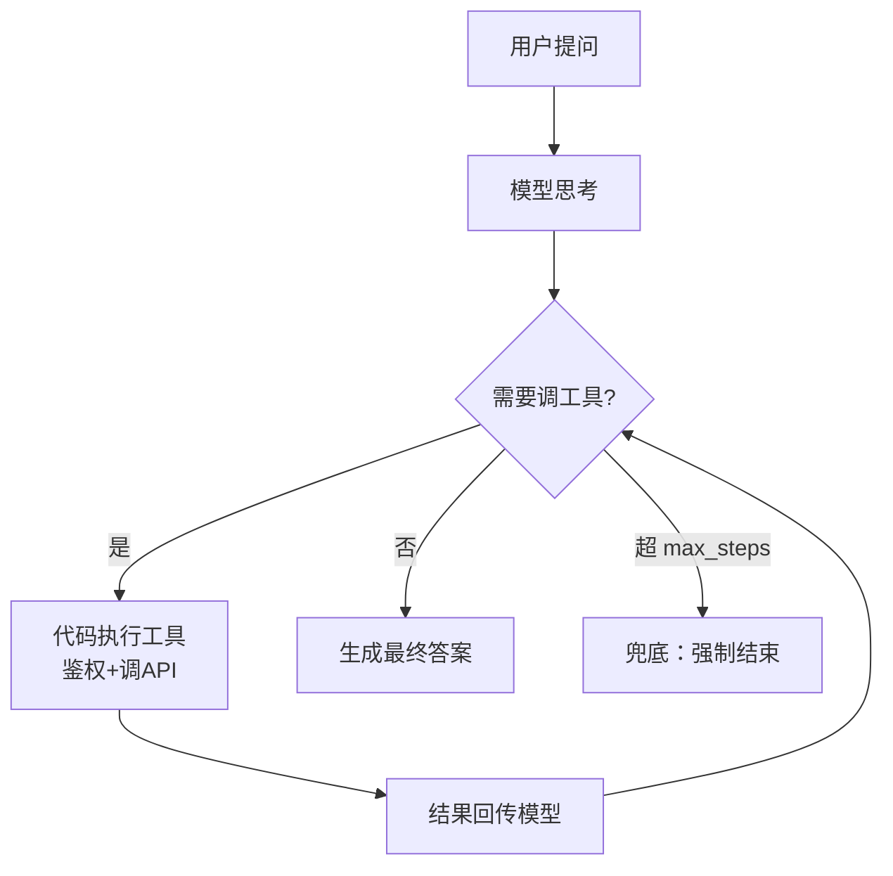
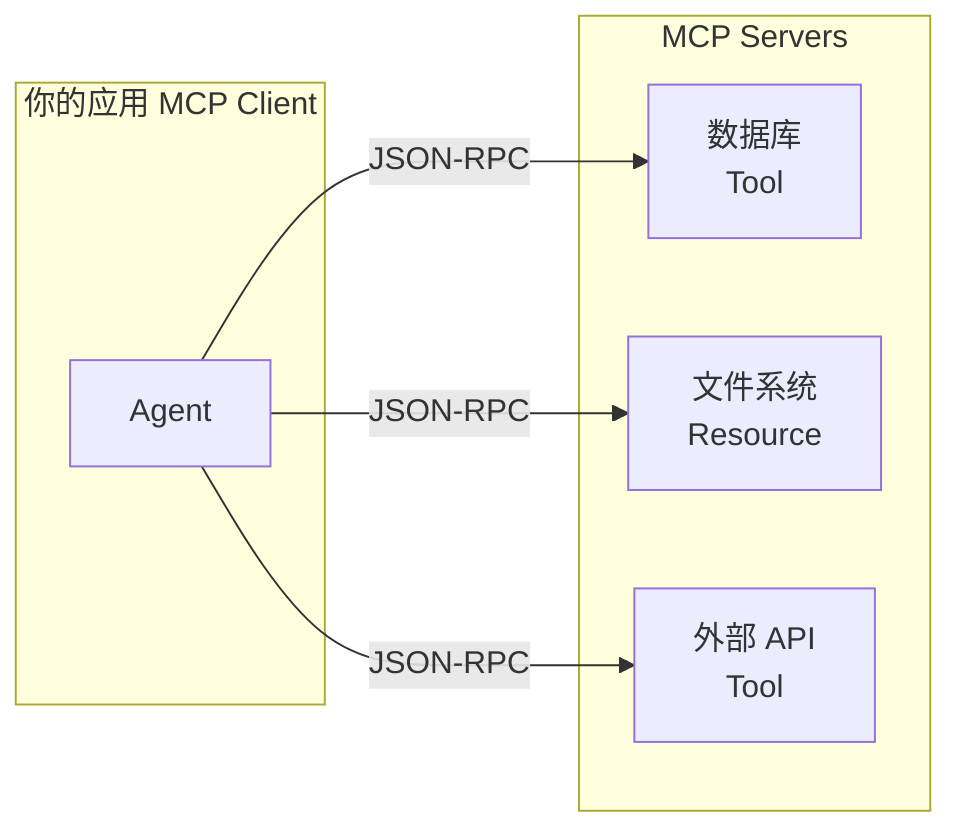

---
tags:
  - 概念卡
status: 已理解
created: 2026-09-10
source: ""
---

# Agent 与 MCP

## 一句话定义
> Agent（AI 智能体）= 思考 → 调工具 → 观察结果 → 再思考 的循环，直到信息足够才生成最终答案；MCP（Model Context Protocol，模型上下文协议）= 工具的标准化接入协议，像 USB-C 一样让工具即插即用。

## 为什么需要
- Agent 解决的问题：单次 Function Calling 只能处理"一个问题 → 一个工具"的简单场景；复杂任务需要多步推理、多工具串联、条件分支，Agent 循环提供这个能力。
- MCP 解决的问题：没有 MCP 时，每个工具（数据库、API、文件系统）都要写独立适配代码，工具一换就重写。MCP 统一了工具的发现和调用协议，服务端实现一次，所有 MCP Client 通用。
- 没有它会怎样：每个工具各自写胶水代码，工具生态割裂，Agent 接入新工具成本高。

## 原理 / 流程

**Agent 循环（ReAct 模式，Reasoning + Acting，推理与行动交替）**
1. 用户提问 → 模型思考 → 决定调哪个工具
2. 你的代码执行工具（鉴权 + 校验 + 调 API）→ 结果以 role: tool 回传
3. 模型观察结果 → 判断：还需要调工具吗？
   - 是 → 回到步骤 2
   - 否 → 生成最终答案
4. 最大轮次（max_steps）兜底，防止死循环烧钱

**MCP 架构**
- MCP Server：工具提供方实现，暴露 Tools（调用工具）、Resources（读取数据/文件）、Prompts（预置提示模板）
- MCP Client：你的应用，通过标准协议发现和调用所有已连接的 Server
- 协议层：JSON-RPC over stdio/SSE（Server-Sent Events，服务器推送事件），定义工具发现、调用、结果返回的格式

## 前端视角类比
- Agent 循环 ≈ **while 循环 + 事件驱动**：模型 emit 工具调用，你执行，模型检查结果决定 break 还是继续 emit。本质是 Function Calling 套了一个循环外壳。
- MCP ≈ **USB-C**：统一接口标准，换工具像换键盘一样即插即用。MCP Server 是外设驱动，MCP Client 是操作系统。
- max_steps ≈ **无限循环保护**：像 React 的 Error Boundary 或 while 循环的迭代上限。
- Tools / Resources / Prompts ≈ 三种 API 端点：POST 执行操作 / GET 读取数据 / 预置模板。

## 关键 API / 参数
| 名称 | 作用 | 注意点 / 默认值 |
| --- | --- | --- |
| max_steps | 最大工具调用轮次 | 通常 5~20；防止死循环，超限后强制让模型基于已有信息回答 |
| MCP Server | 工具提供方 | 暴露 Tools/Resources/Prompts 三种能力；通过 JSON-RPC 通信 |
| MCP Client | 工具消费方 | 应用侧集成，发现并调用所有已连接 Server 的工具 |
| ReAct | 推理与行动交替的 Agent 模式 | 最经典的 Agent 范式，还有 Plan-Execute 等变体 |
| tool_choice | 是否强制模型调用工具 | Agent 场景通常设 "auto"，让模型自主判断 |

## 踩过的坑
- [ ] 不设 max_steps → 模型在工具间反复横跳死循环，烧 token
- [ ] 工具报错不回传 → 模型不知道失败，继续调同一个工具（错误必须作为 tool result 回传）
- [ ] 工具描述不清晰 → 模型选错工具或重复调（description 要写清"什么场景用"和"参数含义"）
- [ ] 多工具结果全量回传 → token 膨胀，模型抓不住重点（应裁剪格式化）
- [ ] MCP Server 挂了不降级 → Agent 整体不可用（需超时 + 降级策略）

## 面试追问
- **Q：Agent 和 Function Calling 的区别是什么？**
  **A：** Function Calling 是机制（模型输出工具调用意图），Agent 是模式（把 Function Calling 放进循环里，多步推理直到完成）。Function Calling 一次调用→回答；Agent 可能多轮调用→观察→再调用。
- **Q：MCP 和传统 API 调用的区别？**
  **A：** 传统 API 每个工具自己写适配代码；MCP 统一了工具发现（list tools）、调用（call tool）、结果返回的协议，模型能自动发现"有哪些工具可用"，不需要硬编码。MCP 是工具接入的标准，不是新的工具类型。
- **Q：Agent 死循环怎么办？**
  **A：** 三层防护：max_steps 硬上限（超了强制结束）、工具调用去重（连续 3 次调同一工具同样参数就中断）、token 预算（总消耗超预算就终止）。
- **Q：多 Agent 协作（multi-agent）是什么？**
  **A：** 多个 Agent 各自负责不同领域，通过消息传递协作。如一个 Agent 管检索、一个管代码生成、一个管审核。优势是单一 Agent 的 prompt 更聚焦，劣势是协调开销大。入门阶段先做好单 Agent 即可。

## 关联
- 上位概念：[[LLM 核心心智模型]]
- 相关概念：[[Function Calling]]、[[对话消息结构]]、[[RAG 全链路]]
- 项目实践：[[03 Agent 与 MCP Demo]]

## 费曼问答记录
- Q: Agent 和 Function Calling 到底差在哪？
  A: Agent 是推理-工具调用-观察的循环（ReAct 模式），直到信息足够才生成最终答案；Function Calling 只是单次工具调用→回答。Agent = Function Calling 套了一个 while 循环。
- Q: "查北京天气，如果下雨就订一把伞"——Agent 怎么处理？调几次工具？
  A: 2 次工具调用，对应 2 轮循环。第 1 轮：调用 get_weather → 观察结果下雨 → 判断需要再调工具；第 2 轮：调用 order_umbrella → 观察下单成功 → 判断信息足够，生成最终答案。"观察-判断-再调"的节奏是 Agent 区别于脚本的本质，不是同一轮里连调两次。
- Q: MCP 解决了什么问题？用 USB-C 类比。
  A: MCP 统一了工具的发现和调用协议（list tools / call tool / 结果返回），像 USB-C 统一了外设接口。工具提供方实现 MCP Server，应用作为 MCP Client 即插即用，不需要为每个工具单独写适配代码。
- Q: 如果 MCP Server 进程崩了，Agent 的行为会怎样？生产环境该怎么兜底？
  A: Agent 不会“继续循环调用 MCP”解决问题；MCP Client 会在工具发现或工具调用阶段失败，表现为接口 500、流式 output-error，或该工具不可用。生产环境要做超时、重连、健康检查、降级提示、工具禁用和可观测日志，避免一个 MCP Server 挂掉拖垮整条对话链路。
- Q: stepCountIs(5) 为什么是“上限”而不是“必跑 5 步”？谁决定提前结束？
  A: stepCountIs(5) 只是最多允许 5 轮模型-工具循环。每轮工具结果回传后，LLM（Large Language Model，大语言模型）会基于当前上下文决定继续调用工具还是生成最终答案；工具结果只是输入信号，真正决定提前结束的是模型输出不再包含 tool_call。

## 费曼验收
- [x] 不看笔记能给外行讲清楚（2026-09-10 首次复述全部通过）
- [x] 能徒手写出最小可运行 demo（2026-09-22 完成 demo 03：多工具 Agent + MCP calculator）
- [ ] 模拟面试中能答出追问
