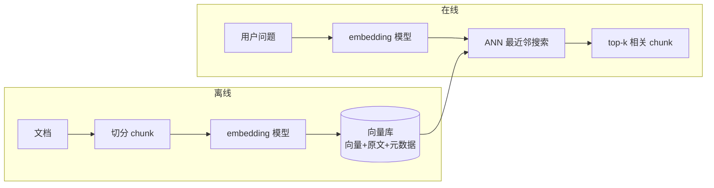

---
tags:
  - 概念卡
status: 已理解
created: 2026-09-09
source: ""
---

# Embedding 与向量检索

## 一句话定义
> embedding 模型把文本转成固定长度的语义向量，语义相近的文本向量距离相近；向量库存放这些向量并支持按"问题向量"快速找最近邻（top-k），实现跨字面的语义检索。

## 为什么需要
- 解决的问题：关键词检索只能匹配字面（"社保怎么交" vs "五险一金缴纳流程"零共同词就漏召回）；embedding 匹配的是语义。
- 没有它会怎样：知识库问答只能搜到含相同关键词的文档，同义词、改写、跨语言都无法命中；RAG 的"检索"环节没有技术底座。

## 原理 / 流程
1. **离线**：文档切分为 chunk → 每个 chunk 过 embedding 模型得向量 → 向量 + 原文 + 元数据（来源/页码/标题/ACL 权限，ACL = Access Control List，访问控制列表）写入向量库。
2. **在线**：用户问题 → 同一 embedding 模型转向量 → 向量库 ANN（Approximate Nearest Neighbor，近似最近邻）搜索 → 返回 top-k 最相似 chunk。
3. 相似度用余弦相似度（cosine similarity，衡量两个向量方向是否一致）衡量，向量归一化后等于点积。
4. ANN 索引让百万级向量的最近邻查找亚线性完成，常见实现：HNSW（Hierarchical Navigable Small World，分层可导航小世界图索引）、IVFFlat（Inverted File Flat，倒排文件平面索引）。
5. 查询和文档必须用**同一个 embedding 模型**（向量空间一致才能比距离）。

## 前端视角类比
- embedding ≈ 文本的"语义坐标"：像颜色表示为 `rgb(255,200,100)`，语义用 1024 维向量表示；语义近 ↔ 坐标近，正如颜色近 ↔ RGB 距离近。
- 余弦相似度 ≈ 比较两个向量箭头的**方向**是否一致（与长度无关）。
- 向量库 + ANN 索引 ≈ 地图"找最近地铁站"：建了空间索引，不会遍历全城每个点；类比 B-tree 之于精确查找。

## 关键 API / 参数
| 名称 | 作用 | 注意点 / 默认值 |
| --- | --- | --- |
| embedding 模型 | 文本 → 向量 | 维度固定（如 768/1024/1536）；查询与文档必须同模型，换模型要全量重建 |
| chunk size / overlap | 切分块大小/重叠 | 太大稀释语义、太小丢上下文；overlap 避免句子被切断 |
| top-k | 取回 chunk 数 | 常用 3~8；太多引入噪声、太少漏信息 |
| cosine similarity | 距离度量 | 向量需归一化；还有 dot product / L2 两种度量 |
| metadata filter | 元数据过滤 | 按部门/文档类型/权限先过滤再向量搜索，兼顾权限与精度 |

## 踩过的坑
- [ ] 换了 embedding 模型没重建向量库 → 新旧向量空间不一致，距离全错
- [ ] chunk 按固定字符硬切 → 句子/表格被腰斩，语义破碎（应按标题/段落语义切分 + overlap）
- [ ] 只靠向量检索 → 专有名词、编号、错误码等精确匹配场景召回差（生产用混合检索（hybrid search）：向量 + 关键词 BM25（Best Matching 25，关键词相关性排序算法）两路召回，用 RRF（Reciprocal Rank Fusion，倒数排名融合）融合排序）
- [ ] 不做元数据权限过滤 → 检索出用户无权查看的文档片段（权限必须作为 filter 下推到检索语句内，先 WHERE 过滤再取 top-k，不能检索后再剔除）

## 面试追问
- **Q：embedding 向量为什么能表示语义？**
  **A：** embedding 模型在海量文本上训练，学习到"出现在相似语境中的词语义相近"的分布规律，把这种规律压缩为向量坐标；语义相近的文本在训练目标下被优化到向量空间中相邻位置。
- **Q：向量检索和关键词检索什么关系？**
  **A：** 互补。向量擅长语义/同义/改写；关键词（BM25）擅长精确匹配专有名词、编号、错误码（BM25 要点：词命中得分、罕见词权重高、短文档权重高）。生产用混合检索（hybrid search）两路召回，再用 RRF 等算法融合排序。
- **Q：top-k 是不是越大越好？**
  **A：** 不是。k 大引入不相关 chunk 制造噪声、稀释上下文、增加 token 成本；k 小可能漏召回。一般 3~8 起步，配合 rerank 精排。
- **Q：文档权限怎么保证？**
  **A：** 权限作为 metadata filter 下推到向量库查询（类似 SQL WHERE acl 包含当前用户），在可见集合内算距离取 top-k；不能先检索再在应用层剔除（会造成召回缺口和数据出库风险）。

## 关联
- 上位概念：[[LLM 核心心智模型]]
- 相关概念：[[Function Calling]]、[[RAG 全链路]]
- 项目实践：[[ ]]

## 费曼问答记录
- Q: 公司换了一个更强的 embedding 模型，同事直接把新模型接上就上线，向量库旧数据没动——会发生什么？
  A: 无法正确检索。新旧 embedding 模型的向量空间不一致，旧向量在新模型下算出的距离无意义。换模型必须全量重建向量库。
- Q: 用户在知识库里搜"错误码 E1024 怎么解决"，纯向量检索效果可能很差，为什么？怎么补？
  A: 向量检索擅长语义匹配，但 E1024 这种编号/错误码没有语义信息，需要精确字面匹配。补法：混合检索（hybrid search）——向量 + BM25（Best Matching 25，关键词排序算法）两路召回，再用 RRF（Reciprocal Rank Fusion，倒数排名融合）融合排序。
- Q: 普通员工提问时，top-k 检索出了只有 HR 能看的薪酬制度片段——问题出在哪？正确做法？
  A: 权限过滤应该在检索语句内部完成（metadata filter 下推到向量库，类似 SQL WHERE acl 包含当前用户，先过滤再取 top-k），不能先检索再在应用层剔除（会造成召回缺口和数据出库风险）。
## 费曼验收
- [x] 不看笔记能给外行讲清楚（2026-09-10 首测：卡点 BM25/混合检索、权限 filter 下推；2026-09-14 复习通过：完整复述混合检索（向量+BM25+RRF）、权限过滤下推到检索语句内，表述准确）
- [ ] 能徒手写出最小可运行 demo
- [ ] 模拟面试中能答出追问
- [ ] 能徒手写出最小可运行 demo
- [ ] 模拟面试中能答出追问
