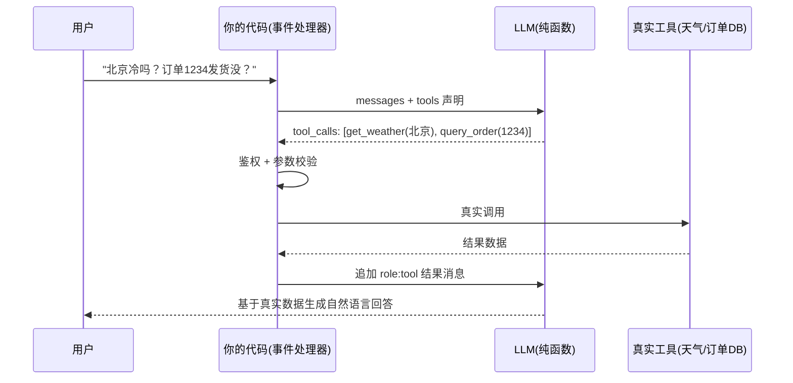

---
tags:
  - 概念卡
status: 已理解 # 学习中 / 已理解 / 已考核 / 需复习
created: 2026-09-09
source: ""
---

# Function Calling

## 一句话定义
> 模型不执行任何代码；function calling 是模型输出结构化的"调工具意图"（函数名 + JSON 参数），由调用方代码真实执行工具、再把结果回传给模型的事件驱动机制。

## 为什么需要
- 解决的问题：LLM 本身只会生成文本，无法获取实时数据、无法操作业务系统；function calling 让模型能"使用工具"（查库、调 API、搜索、算数）。
- 没有它会怎样：只能靠 prompt 让模型"输出 JSON 我自己解析"——格式不稳定、参数易幻觉；也无法构建能干活的 Agent。

## 原理 / 流程
1. 请求中声明 tools：函数名、description（模型靠它判断何时调用）、JSON Schema 参数定义。
2. 模型判断需要工具时，不返回普通文本，而返回 `tool_calls`（函数名 + 参数 JSON）。
3. **调用方代码**执行真实函数（API/DB/搜索），执行前做鉴权与参数校验。
4. 结果以 `role: tool` 消息回传，模型可继续调下一个工具或生成最终回答。
5. 多轮工具调用循环直到模型给出无 tool_calls 的最终回复。

## 前端视角类比
- 模型 ≈ **只派发事件、无副作用的纯渲染层/子组件**；tools 声明 ≈ props/事件的类型定义。
- tool_calls ≈ 子组件 `emit('action', payload)`，payload 需符合 schema。
- 服务端 ≈ **父组件的事件处理器**：真实权限与副作用都在这里（先鉴权再调 API，结果通过 props 回传）。
- 模型决定"做什么"，你的代码决定"能不能做、怎么做"。

## 关键 API / 参数
| 名称 | 作用 | 注意点 / 默认值 |
| --- | --- | --- |
| tools[].description | 工具用途说明 | 模型选择工具的唯一依据，要写清"什么时候用" |
| tools[].parameters | JSON Schema 参数定义 | 必填字段、枚举、类型约束写严，减少幻觉参数 |
| tool_calls | 模型返回的调用意图 | 参数是模型生成的 JSON，必须做运行时校验（zod 等） |
| role: tool | 工具结果回传消息 | 要带 tool_call_id 与调用一一对应 |
| tool_choice | 是否强制调用 | 可设 "auto" / "required" / 指定函数 |

## 踩过的坑
- [ ] 把工具返回的原始数据全量回传 → token 膨胀、模型抓不住重点（应在代码里裁剪/格式化）
- [ ] 不校验模型生成的参数直接查库 → 参数幻觉导致报错或越权（必须 zod 校验 + 鉴权）
- [ ] 工具报错直接抛异常断流 → 应把错误信息作为 tool 结果回传，让模型换策略或告知用户
- [ ] 工具循环无上限 → Agent 死循环烧钱（需设最大轮次）

## 面试追问
- **Q：模型是怎么"调用"函数的？**
  **A：** 它不调用。模型只输出结构化的调用意图（函数名+参数），真实执行由调用方代码完成，结果再回传模型。模型始终是无状态纯函数。
- **Q：工具的权限控制应该在哪做？**
  **A：** 调用方代码（服务端）。模型输出不可信，执行前必须鉴权 + 参数校验；模型无权决定谁能做什么。
- **Q：function calling 和 RAG 是什么关系？**
  **A：** RAG 里的"检索"本身就是一种工具——模型决定需要查知识库时，emit 一个 retrieve(query) 调用，你的代码做向量检索后把片段回传。RAG 是 function calling 在知识场景的典型应用。

## 关联
- 上位概念：[[LLM 核心心智模型]]
- 相关概念：[[对话消息结构]]、[[RAG 全链路]]、[[Agent 与 MCP]]
- 项目实践：[[ ]]

## 费曼问答记录
- Q: 用户说"帮我把订单 1234 退了"，模型返回 tool_calls: refund_order——在真正调退款接口之前，必须做哪两件事？
  A: 参数校验（zod 等 schema 校验）+ 鉴权（检查当前用户是否有退款权限）。不可逆操作还要加：显式二次确认 + 幂等键防重复打款。
- Q: 模型返回的参数是 order_id: "12; DROP TABLE orders"——说明模型输出的参数能不能直接信任？怎么拦？
  A: 不能信任，模型输出不可信。两层防护：schema 校验挡格式和类型（zod），参数化查询挡注入（SQL 永远用占位符不拼字符串）。
- Q: 工具执行时第三方支付接口超时了，你代码直接抛 500——有什么问题？更好处理是什么？
  A: 用户看到 500 不知道发生了什么。正确做法：错误作为 tool result 回传模型，让模型告知用户或换策略。错误要分类：可重试（超时/限流）先指数退避再回传，致命错误（参数/权限）直接回传不重试。
## 费曼验收
- [x] 不看笔记能给外行讲清楚（2026-09-09 通过：三题命中"参数校验+鉴权""参数不可信、调用前校验""错误回传模型"；补充：不可逆操作需二次确认+幂等键；注入靠参数化查询根治；错误分类——可重试先指数退避、致命错误直接回传）
- [ ] 能徒手写出最小可运行 demo
- [ ] 模拟面试中能答出追问
