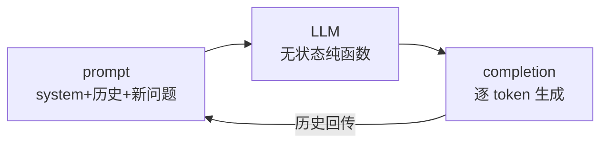

---
tags:
  - 概念卡
status: 已理解
created: 2026-09-09
source: ""
---

# LLM（Large Language Model，大语言模型）核心心智模型

## 一句话定义
> LLM 是一个"输入文本 → 逐 token 预测输出文本"的**无状态纯函数**；能力、记忆、上下文全都要由调用方在每次请求里显式提供。

## 为什么需要
- 解决的问题：建立对大模型 API 的正确预期，避免"把模型当人"的设计错误。
- 没有它会怎样：踩三类经典坑——
  - 以为模型有记忆 → 多轮对话只发最新一条，模型"失忆"；
  - 以为上下文无限 → 文档全塞 prompt，超限报错或成本爆炸；
  - 以为输出确定 → 没做 structured output，解析 JSON 随机失败。

## 原理 / 流程
1. **token**：文本切分单位（约 0.75 个英文单词 / 1~2 个汉字）。窗口大小、计费、延迟都按 token 计。
2. **无状态**：每次 API 调用相互独立，服务端不保存会话；多轮对话 = 客户端把历史消息全量重发。
3. **上下文窗口**：输入 + 输出共享 token 上限（如 128k / 200k）；超了报错或截断，需要自己做裁剪/摘要。
4. **生成式输出**：模型逐 token 采样生成；temperature 控制随机性（0 = 接近确定）。

## 前端视角类比
- LLM ≈ **纯函数组件**：props（prompt）相同则渲染（completion）相同（temperature=0 时）。
- 会话历史 ≈ **React state**：组件不持有数据，state 在外部维护，每次渲染完整传入。
- 上下文窗口 ≈ **props 大小限制**：超了要自己分页/裁剪（对应 RAG、上下文管理、摘要记忆）。
- 逐 token 输出 ≈ **流式渲染**：天然对应 SSE（Server-Sent Events，服务器推送事件），前端要处理增量拼接。

## 关键 API / 参数
| 名称                | 作用                          | 注意点 / 默认值                |
| ----------------- | --------------------------- | ------------------------ |
| context window    | 输入+输出 token 总上限             | 输入输出共享，输出要预留 max_tokens  |
| temperature       | 采样随机性                       | 0 适合结构化抽取/分类，0.7+ 适合创作   |
| max_output_tokens | 单次最大输出                      | 输出被截断时 finish_reason 会标记 |
| 价格                | 按 input/output 每百万 token 计费 | output 通常比 input 贵 3~5 倍 |

## 踩过的坑
- [ ] 多轮对话只发最后一条消息 → 模型丢失上下文（正确做法：维护 messages 数组全量传）
- [ ] 把长文档直接拼进 prompt → 超窗口报错 / 成本失控（正确做法：RAG 检索相关片段）
- [ ] 让模型直接返回自由文本再正则解析 JSON → 随机失败（正确做法：structured output / JSON mode）
- [ ] 忽略流式场景的错误处理 → SSE 中途断了前端无感知

## 面试追问
- **Q：为什么多轮对话越聊越贵、越慢？**
  **A：** 模型无状态，历史消息每次全量重发，input token 随轮次线性增长；prefill（预填充，模型处理全部输入 token 的阶段）计算量随之增大，首字延迟和费用都上升。工程对策：滑动窗口截断、摘要压缩、外部记忆（RAG）。
- **Q：上下文窗口 128k，是不是就能一次塞 100k 文档？**
  **A：** 技术上能，但有三个问题：成本高、长上下文中间信息容易被忽略（"lost in the middle"）、延迟大。生产上仍应检索后只传相关片段。
- **Q：temperature 设 0 输出就完全确定吗？**
  **A：** 接近确定但不保证，模型服务端批处理/浮点差异仍可能导致轻微变化；要求严格一致需要更强约束或缓存。

## 关联
- 上位概念：[[ ]]
- 相关概念：[[对话消息结构]]、[[Function Calling]]、[[Embedding 与向量检索]]
- 项目实践：[[ ]]

## 费曼问答记录
- Q: 为什么跟 AI 聊了 20 轮之后，回复变慢了、变贵了？
  A: LLM 无状态，每次请求把历史全部 messages（含 assistant 回复）重发，input token 随轮次线性增长，prefill（预填充）计算量随之增大，首字延迟和费用都上升。
- Q: 为什么不能把一本 500 页的文档直接丢给它让它回答？
  A: 上下文窗口有 token 上限，超了会报错或截断；即使塞得下，长上下文中间信息容易被忽略（lost in the middle），且成本高、延迟大。正确做法是 RAG 检索相关片段。
- Q: 模型到底"记不记得"上一句说了什么？
  A: 不记得。模型是无状态纯函数，记忆不在模型里，是系统的责任。应用层维护 messages 数组，每次全量重发。
## 费曼验收
- [x] 不看笔记能给外行讲清楚（2026-09-09 复述通过：无状态重发/上下文限制/无记忆三题命中核心，修正点：重发的是含 assistant 回复的完整 messages；超长是报错截断而非"丢失"）
- [ ] 能徒手写出最小可运行 demo
- [ ] 模拟面试中能答出追问
