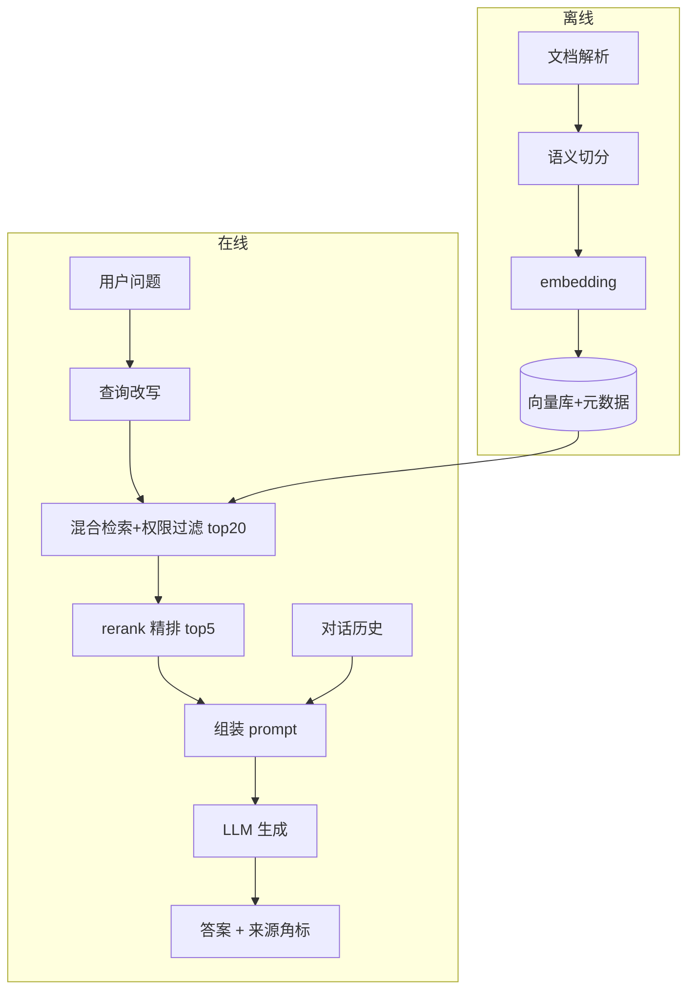

---
tags:
  - 概念卡
status: 已理解
created: 2026-09-10
source: ""
---

# RAG 全链路

## 一句话定义
> RAG（Retrieval-Augmented Generation，检索增强生成）= 用户提问时先从知识库里检索出相关文档片段，再把片段塞进 prompt 让模型"开卷考试"，基于检索内容生成带来源的答案；解决模型知识过时、无企业私有数据、幻觉和上下文装不下全量文档的问题。

## 为什么需要
- 解决的问题：模型不知道企业私有文档；模型训练数据有截止日期；直接问答会幻觉；全量文档塞不进上下文窗口。
- 没有它会怎样：问答只能靠模型参数记忆（过时/编造/无出处），或全量塞文档导致超窗口、高成本、lost in the middle。

## 原理 / 流程

**离线链路（构建/增量更新）**
1. 文档解析：PDF/Word/飞书/网页 → 文本 + 结构（标题层级、表格）。
2. 切分 chunking：按语义边界（标题/段落）切，非固定字符；chunk 间留 overlap。
3. 向量化：每个 chunk 过 embedding 模型。
4. 入库：向量 + 原文 + 元数据（来源、页码、ACL（Access Control List，访问控制列表）权限）写入向量库。

**在线链路（每次提问）**
1. 查询改写（可选）：消解多轮指代/省略（"那它多少钱" → "iPhone 16 价格"）。
2. 粗检索：问题向量化 → 混合检索（向量语义 + BM25 关键词，RRF 融合；BM25 = Best Matching 25，关键词排序算法；RRF = Reciprocal Rank Fusion，倒数排名融合）→ 元数据权限过滤 → top-20。
3. rerank（重排序）精排：用 cross-encoder（交叉编码器，把问题和文档拼在一起送入模型打分的精排模型）对粗排结果逐一打分取 top-5（粗排快而粗保召回，精排慢而准保准确）。
4. 组装 prompt：system 约束 + 带来源标注的 chunks + 历史 + 问题；硬约束"只依据资料、不足就说不知道、禁止编造"。
5. 生成：流式输出（SSE，Server-Sent Events，服务器推送事件，模型边生成前端边渲染）。
6. 溯源：答案标注引用 chunk（角标 + 来源链接）。

## 深度解析：双塔 vs 交叉编码（rerank 为什么准）
- **query**：用户实时输入的查询（每次提问只有 1 条）；**doc**：知识库中被搜索的 chunk（离线准备好，几万~几百万条）。检索 = 从海量 doc 中找与 query 最相关的几条。
- **双塔编码（bi-encoder / dual-encoder，双编码器，粗排）**：query 和 doc 分别通过两座独立模型塔编码成向量，互不见面，最后只算余弦距离。doc 向量可离线预计算，在线只需 1 次 query 编码 + ANN（近似最近邻）索引搜索，毫秒级；但长文档被压缩成单个向量、细节丢失，模型编码 doc 时不知道 query 是什么，只能产出"通用语义摘要"。
- **交叉编码（cross-encoder，交叉编码器，精排）**：query 和 doc 用 [SEP]（separator，分隔符）拼成一整段送入同一模型，attention（注意力机制）让 query 每个词看到 doc 每个词，输出相关度得分。带问题精读、词级匹配，准；但 doc 无法预计算（query 一变整条输入就变），N 条候选 = N 次完整在线推理，只能对粗排结果做。
- **配合**：全库 → 双塔粗排 top-20（保召回率 recall，宁可错召不可漏）→ 交叉编码精排 top-5（保精确率 precision，少而准）→ 塞进 prompt。

## 前端视角类比
- 离线索引 ≈ 构建期预计算（SSG）；在线检索 ≈ 请求时查库（SSR 取数）。
- 粗排 + rerank ≈ 搜索结果的粗筛 + 二次精排（性能与精度分层）。
- prompt 组装 ≈ 拼 HTML 模板：模型是模板引擎，检索结果是数据。
- 溯源角标 ≈ 引用链接。

## 关键 API / 参数
| 名称 | 作用 | 注意点 / 默认值 |
| --- | --- | --- |
| chunk size / overlap | 切分粒度 | 常用 300~800 token + 10% overlap；按文档结构调整 |
| 粗排 top-k | 召回数 | 20 左右，宁多勿漏 |
| rerank top-n | 精排后保留数 | 3~5，喂给生成 |
| similarity threshold | 相关度阈值 | 低于阈值直接答"未找到"，不强行生成 |
| cross-encoder | rerank 模型 | 查询与文档拼接过模型，准但贵；不用于全库检索 |

## 踩过的坑
- [ ] 固定字符硬切 → 表格/代码块/语义被腰斩（按结构切 + overlap）
- [ ] 多轮指代不处理 → 用"那它呢"直接检索，向量全偏（加查询改写）
- [ ] 检索后才做权限过滤 → 召回缺口 + 数据出库（filter 下推，见 [[Embedding 与向量检索]]）
- [ ] 只做粗排不 rerank → 相关片段排在 20 名外没进 prompt
- [ ] 不设相关度阈值 → 知识库里没有也强行编造答案
- [ ] 文档更新后向量不重建 → 答案引用过期制度（需要增量索引/版本管理）

## 面试追问
- **Q：为什么要粗排 + rerank 两阶段？**
  **A：** 向量检索是双塔编码（query/doc 各自编码算距离），快但粗，适合全库粗召回；rerank 是 cross-encoder（query 和 doc 拼接一起过模型），准但计算贵，只对粗排的 20 条做。粗排保召回率，精排保准确率，是成本与效果的分层。
- **Q：RAG 能消灭幻觉吗？**
  **A：** 不能，只能显著降低。还要：prompt 硬约束"无依据说不知道"、相关度阈值兜底、引用一致性校验、eval 集回归评测。
- **Q：RAG 和微调（fine-tuning）怎么选？**
  **A：** 知识类/频繁更新/要溯源 → RAG；风格/格式/固定技能（输出语气、领域表达模式）→ 微调（fine-tuning，在模型参数上继续训练）；二者可叠加。RAG 改数据即可，微调要重训。
- **Q：怎么评估 RAG 效果？**
  **A：** 拆两段评：检索质量（召回率/命中率/MRR（Mean Reciprocal Rank，平均倒数排名，衡量正确结果在排序列表中位置的指标），看正确 chunk 是否进 top-k）+ 生成质量（答案正确性、引用忠实度、拒答合理性），建标注 eval 集做回归。

## 关联
- 上位概念：[[LLM 核心心智模型]]
- 相关概念：[[Embedding 与向量检索]]、[[Function Calling]]、[[对话消息结构]]
- 项目实践：[[ ]]

## 费曼问答记录
- Q: 员工上传/更新文档后，离线做哪几件事？
  A: 文档解析（PDF/Word → 文本+结构）→ 语义切分（chunking，按标题/段落，留 overlap）→ embedding 向量化 → 入库（向量 + 原文 + 元数据：来源、页码、ACL 权限）。
- Q: 员工提问后，在线经过哪些环节才返回答案？
  A: 查询改写（可选，消解多轮指代）→ 混合检索（向量+BM25，元数据权限过滤）→ 粗召回 top-20 → rerank（重排序）精排 top-5 → 组装 prompt（system 约束 + 带来源标注的 chunks + 历史 + 问题）→ 模型流式生成 → 溯源标注。
- Q: 为什么检索要分"粗排 top-20 + rerank 精排 top-5"两步？
  A: 粗排是双塔编码（query 和 doc 各自算向量距离），快但粗，适合全库召回；精排是 cross-encoder（交叉编码器，query 和 doc 拼接后完整过模型打分），准但贵，只对粗排结果做。粗排保召回率，精排保准确率。
- Q: 第二轮问"那这个制度和去年有什么区别"——直接拿这句话去检索会有什么问题？怎么办？
  A: "那"和"这个"是省略指代，向量库里搜不到。需要查询改写（query rewriting）：用 LLM 把多轮依赖消解为独立查询，如"2025 年考勤制度 与 2024 年考勤制度 区别"。
- Q: 知识库里没有相关文档，系统却返回了编造答案——在哪个环节、用什么手段兜底？
  A: 三层兜底：prompt 硬约束"不足就说不知道"、相关度阈值（similarity threshold，相似度低于阈值直接拒答）、答案与引用一致性校验。
## 费曼问答记录（复习轮）
- Q（2026-09-14 复习）：完整复述离线/在线链路 + 双塔 vs 交叉编码。
  A: 通过。离线：文档解析 → 语义切分（留 overlap）→ embedding → 入库（向量+原文+元数据）；在线：查询改写 → 混合检索（向量+BM25+权限 filter 下推）→ 双塔粗排 top-20 → 交叉编码 rerank 精排 top-5 → prompt 组装 → 流式生成 → 溯源。双塔独立编码算距离、doc 可预计算故快但粗；交叉编码 query/doc 用 [SEP] 拼接过模型、attention 词级交互故准但无法预计算。唯一措辞提醒：离线要显式区分"文档解析"与"切分"两个得分点。

## 费曼验收
- [x] 不看笔记能给外行讲清楚（2026-09-10 首测漏环节；2026-09-14 复习完整复述通过，详见下方复习轮记录）
- [ ] 能徒手写出最小可运行 demo
- [ ] 模拟面试中能答出追问
