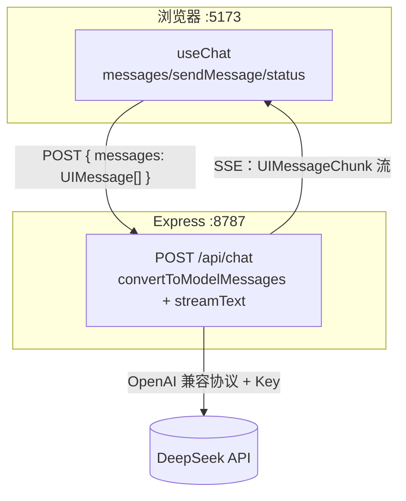

---
tags:
  - 项目复盘
status: 已完成
created: 2026-09-15
repo: "demos/01-streaming-chat（vault 内，node_modules 已被 Obsidian/git 忽略）"
demo: ""
---

# 01 流式 Chat Demo

## 一句话介绍
> 面试 30 秒版本：基于 React 19 + Vercel AI SDK v7 + Express + DeepSeek 实现的流式对话应用，前端通过 SSE 逐字渲染模型输出，API Key 收口在后端；独立打通"UIMessage 协议转换 → streamText → UI 消息流回流"全链路，作为后续 Function Calling / Agent demo 的基座。

## 目标与场景
- 解决什么问题：把概念卡上学的 messages 结构、SSE 流式输出、无状态模型三条知识点落到可运行代码。
- 目标用户：自己（学习项目）。
- 为什么需要 AI：对话能力必须由 LLM 提供，传统后端无法实现自然语言多轮交互。

## 技术栈
| 层 | 选型 | 为什么选它（备选方案是什么） |
| --- | --- | --- |
| 前端 | React 19 + Vite + TypeScript | 前端工程师零跨语言成本；备选 Next.js，但学习阶段前后端分离更能看清数据流 |
| AI 编排 | Vercel AI SDK v7（ai@7.0.99 + @ai-sdk/react@4） | TS 原生、流式/消息协议/SSE 封装完整；备选直接调 fetch + SSE，样板太多且易错 |
| 模型 | DeepSeek（deepseek-chat，OpenAI 兼容接口） | 国内直连、便宜、用 createOpenAI 改 baseURL 即可接入；备选 OpenAI 需代理 |
| 后端 | Express + tsx watch | 极简 HTTP 层，只做 Key 收口和协议转换 |
| 存储 / 向量库 | 无（内存态，刷新即丢） | 本 demo 不需要；后续接持久化 |
| 部署 | 本地开发（5173 前端 / 8787 API，Vite proxy） | — |

## 架构图

## 关键决策（面试重点）
1. **决策：API Key 只放后端 `.env`，浏览器只调自己的 /api/chat**
   - 备选方案：前端直连 DeepSeek（省一个后端）。
   - 选择理由：前端代码对用户完全可见，Key 写进前端等于公开，会被盗刷额度；后端收口也为后续加鉴权、限流、工具执行留位置。
   - 代价 / 取舍：多一层服务端和流式转发，复杂度上升。
2. **决策：用 UIMessage 协议（parts 结构）而不是裸 messages 字符串**
   - 备选方案：自己拼 `{role, content}`。
   - 选择理由：v7 的 useChat/transport/工具调用 UI 状态都建立在 parts 上，服务端 convertToModelMessages 统一转换；裸字符串在下个 demo 加 tool part 时会推倒重来。
   - 代价 / 取舍：多一层协议概念，渲染时要 filter isTextUIPart。

## 踩坑记录
| 问题 | 现象 | 根因 | 解决方式 | 概念链接 |
| --- | --- | --- | --- | --- |
| async 函数漏 await | `TypeError: messages.some is not a function`，值 truthy 但不是数组 | convertToModelMessages 是 async，返回 Promise；Promise 没有数组方法。tsx 用 esbuild 转译不做类型检查，运行时才炸 | 调用处加 await；并用 `npx tsc --noEmit` 验证（类型上 Promise\<T\> 不能赋给 T） | [[对话消息结构]] |
| AI SDK v7 API 与网上旧教程不一致 | tsc 报 pipeUIMessageStreamToResponse 参数数量错；`ai/react` 子路径不存在 | v7 破坏性变更：React hooks 拆到 @ai-sdk/react；pipeUIMessageStreamToResponse 改为单参数对象 {response, stream}；sendMessage 签名变为 {text} | 以 node_modules 内 .d.ts 实际签名为准，不背旧博客 API | [[LLM 核心心智模型]] |
| 列表 key 用 index / 多余的 role 标题 | 代码 review 发现 | 流式高频更新时 index 作 key 有 DOM 复用风险；角色已由气泡位置表达，h3 是视觉噪音 | key 用 message.id；删除 h3 | — |

## 效果与评估
- 评估方式：人工验证——发送消息后文字逐字出现；生成中按钮禁用显示"生成中"；多轮对话模型能引用上文。
- 关键数据：本地首字延迟约 1~2s（DeepSeek API），无成本统计。
- 已知缺陷与兜底策略：
  1. **无错误处理**：Key 失效/超时会抛未捕获异常；下个 demo 必须 try/catch 返回 500 + 前端 onError 提示。
  2. 消息仅存内存，刷新丢失。
  3. system prompt 未真正落实"3 句话以内"的约束（当前文案偏弱）。

## STAR 面试素材
- **S 情境：** 系统学习 LLM 应用开发，需要把"无状态模型、messages 全量重发、SSE 流式"等纸面概念变成可运行代码。
- **T 任务：** 一天内独立搭出前后端分离的流式对话应用，且模型 Key 不能暴露到浏览器。
- **A 行动：** 选 TS 原生的 Vercel AI SDK，先核对 v7 真实类型签名再写代码；遇到 `messages.some is not a function` 沿"报错点→值来源"回溯，定位到 async 转换函数漏 await，并建立"tsx 跑逻辑 + tsc 把类型关"的双重验证习惯。
- **R 结果：** 全链路打通，SSE 逐字输出正常，tsc 零错误；项目沉淀为后续 Function Calling / Agent demo 的可复用基座。

## 覆盖的考点
- [[对话消息结构]]、[[LLM 核心心智模型]]（无状态、流式、token）
- 待覆盖：[[Function Calling]]（demo 02）、[[Agent 与 MCP]]（demo 03）

## 下一步迭代
- [ ] demo 02：加 getWeather 工具（tool 定义 + execute + 多步停止条件 + 前端渲染 tool part）
- [ ] 补服务端 try/catch 错误处理与前端 onError
- [ ] 消息持久化（localStorage 起步）
