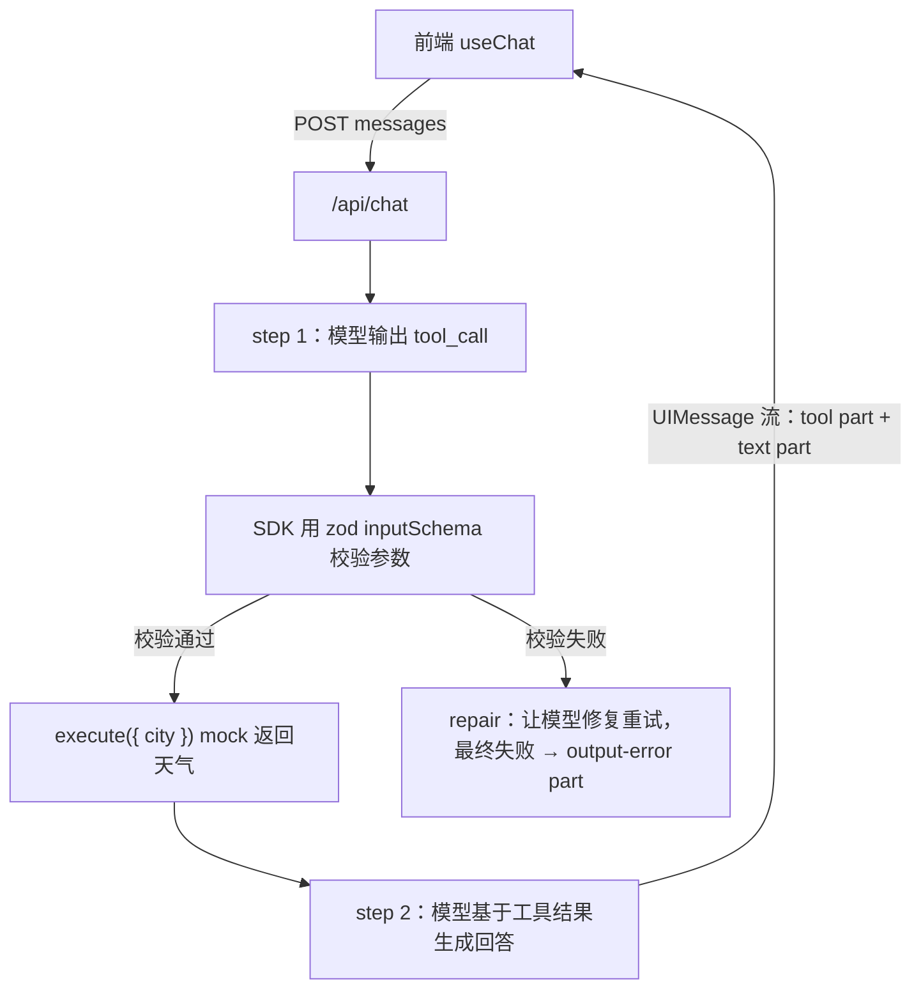

---
tags:
  - 项目复盘
status: 已完成
created: 2026-09-21
repo: "demos/02-function-calling"
demo: ""
---

# 02 Function Calling Demo

## 一句话介绍
> 面试 30 秒版本：在流式 Chat 基座上用 AI SDK v7 的 tool() + zod 定义 getWeather 工具，模型自主判断何时调用；SDK 在 execute 前做参数 schema 校验，工具结果经 UIMessage 流回传，第二步由模型生成自然语言回答；前端按状态机渲染工具调用的全过程（调用中/成功/失败）。

## 目标与场景
- 解决什么问题：把 [[Function Calling]] 概念卡上的三件事——工具 schema 定义、参数校验、结果回传——变成可运行代码，并补上 demo 01 欠下的错误处理。
- 目标用户：自己（学习项目）。
- 为什么需要 AI：自然语言意图理解（判断该不该调工具、参数从问句中提取）必须由 LLM 完成。

## 技术栈
| 层 | 选型 | 为什么选它（备选方案是什么） |
| --- | --- | --- |
| 前端 | React 19 + Vite + TS | 复用 demo 01；新增 tool part 渲染 |
| AI 编排 | AI SDK v7（tool / stepCountIs / toUIMessageStream） | 工具循环、校验、协议封装开箱即用；备选手写 tool_call 解析，需自己处理校验和重试 |
| 校验 | zod 4.6.5 | SDK 一等支持，inputSchema 直接收 zod schema；备选 JSON Schema，写法啰嗦 |
| 模型 | DeepSeek（deepseek-chat） | OpenAI 兼容，支持 function calling |
| 部署 | 本地（5173 / 8787） | — |

## 架构图

## 关键决策（面试重点）
1. **决策：用 stopWhen: stepCountIs(2) 替代旧版 maxSteps**
   - 备选方案：不设（默认 stepCountIs(1)）。
   - 选择理由：默认只跑一步——调完工具拿到结果流就结束，不会生成最终自然语言回复。设 2 = "第 1 步调工具 → 第 2 步生成回答"。
   - 代价 / 取舍：停止条件要按业务最大工具轮次显式声明（多工具串联可能要 3~5）。
2. **决策：校验交给 SDK 的 inputSchema，execute 内只处理业务**
   - 备选方案：execute 内自己写校验。
   - 选择理由：校验失败时 SDK 能自动让模型修复重试，并产出标准 output-error part；execute 内手写会重复这套机制且与 UI 状态脱节。
   - 代价 / 取舍：强依赖 zod/SDK 约定；自定义错误路径要额外接事件。

## 踩坑记录
| 问题 | 现象 | 根因 | 解决方式 | 概念链接 |
| --- | --- | --- | --- | --- |
| Error 对象直接 json 返回 | 前端错误提示为空 | Error.message 不可枚举，JSON.stringify(new Error()) 得到 {} | 返回 error instanceof Error ? error.message : String(error) | [[Function Calling]] |
| output-error 分支漏 className | 失败工具块没有红色样式 | 复制分支时漏挂样式类 | className="tool tool-error" | — |
| JSX 里写 {"&gt"} | 页面原样显示 &gt 文字 | 把 HTML 实体当转义写进了 JS 表达式 | 直接写 Unicode 箭头 → | — |
| description 过薄 | 模型可能选错工具 | 模型靠 description 判断"何时使用"，"查询天气"只说了是什么 | 写全能力 + 使用时机 | [[Function Calling]] |

## 效果与评估
- 评估方式：三组手工验收——
  1. "北京今天天气怎么样？"：先出现灰色工具 chip（参数），变绿（结果），随后自然语言回答；
  2. 对照实验 stepCountIs(1)：工具执行完但无文字回复，验证默认停止条件；
  3. "你好"：不触发工具（toolChoice 默认 auto，模型自主判断）。
- 关键数据：本地两轮 step 总响应约 3~5s。
- 已知缺陷与兜底策略：
  1. 外层 try/catch 只管"流启动前"错误；**流中错误（响应中断）需要 streamText 的 onError 回调**，是下一个要补的点。
  2. execute 未做真实鉴权（学习项目 mock）。
  3. 天气数据是写死的 mock。

## STAR 面试素材
- **S 情境：** 需要让聊天助机能查询实时信息，而模型本身不知道外部世界当前状态。
- **T 任务：** 实现 function calling 全链路，并保证模型生成的不可信参数不会直接进入业务执行。
- **A 行动：** 用 zod 声明工具参数 schema，把校验下沉到 SDK 层（execute 前拦截、失败自动 repair 重试）；查证 v7 文档发现默认 stepCountIs(1) 会"调完工具不说话"，显式设置 stepCountIs(2)；补齐 try/catch，并搞清 Error 对象序列化丢失 message 的坑。
- **R 结果：** 工具调用、状态可视化、自然语言回复全链路打通，tsc 零错误；同时建立"外层 catch + onError 两道防线"的流式错误处理认知。

## 覆盖的考点
- [[Function Calling]]（schema 校验、参数不可信、结果回传、toolChoice）
- [[对话消息结构]]、[[LLM 核心心智模型]]（tool/tool 消息角色、流式）
- 待覆盖：[[Agent 与 MCP]]（demo 03：把单次工具调用升级为多步循环 + MCP 标准协议）

## 下一步迭代
- [ ] demo 03：多工具 + Agent 循环（stopWhen 放大到多步）+ 接一个真实 MCP Server
- [ ] 给 streamText 加 onError，覆盖流中错误
- [ ] execute 内补鉴权占位
