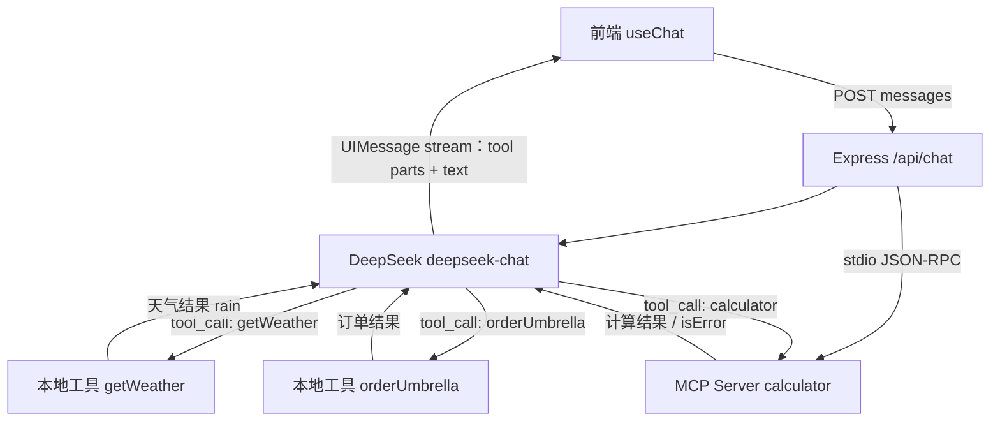

---
tags:
  - 项目复盘
status: 已完成
created: 2026-09-22
repo: "demos/03-agent-mcp"
demo: ""
---

# 03 Agent 与 MCP Demo

## 一句话介绍
> 面试 30 秒版本：在 Function Calling 基座上实现一个多步 Agent：模型先查天气，再根据 rain 条件决定是否订伞，同时通过 MCP（Model Context Protocol，模型上下文协议）接入独立 calculator 工具；前端用同一套 UIMessage 工具 part 渲染本地工具和 MCP 工具，验证“工具来源对 UI 透明”。

## 目标与场景
- 解决什么问题：把 [[Agent 与 MCP]] 概念卡中的“推理 → 调工具 → 观察 → 再决策”循环，以及 MCP 工具标准化接入变成可运行 demo。
- 目标用户：自己（学习项目）。
- 为什么需要 AI：自然语言任务不是固定脚本，模型需要根据工具结果决定是否继续下一步，例如“如果下雨就订伞”。

## 技术栈
| 层 | 选型 | 为什么选它（备选方案是什么） |
| --- | --- | --- |
| 前端 | React 19 + Vite + TS | 复用 demo 02 的工具 part 状态机渲染，本地工具和 MCP 工具共用 UI |
| AI 编排 | AI SDK v7（streamText / tool / stepCountIs / createMCPClient） | 支持多步工具循环和 MCP 工具发现；备选手写 JSON-RPC，学习成本高且容易偏离主线 |
| MCP | @modelcontextprotocol/sdk + stdio transport | 本地 MCP Server 最小闭环；备选 HTTP/SSE Server，更接近生产但样板代码更多 |
| 校验 | zod | 本地工具和 MCP 工具统一用 schema 约束参数 |
| 模型 | DeepSeek（deepseek-chat） | OpenAI 兼容，支持 tool calling |
| 部署 | 本地（5173 / 8787 + MCP 子进程） | 验证主链路优先 |

## 架构图

## 关键决策（面试重点）
1. **决策：用 stepCountIs(5) 放开多步循环**
   - 备选方案：沿用 demo 02 的 stepCountIs(2)。
   - 选择理由：本 demo 需要 weather → umbrella → calculator → 最终回答，2 步不够；5 是上限，不是必跑次数。
   - 代价 / 取舍：上限越大 token 成本越高，需要配合工具去重、超时和预算控制。
2. **决策：calculator 放到独立 MCP Server**
   - 备选方案：像 getWeather 一样直接写成本地 tool。
   - 选择理由：演示 MCP 的核心价值：工具由 server 暴露，client 通过 tools() 发现并转换，不需要在主应用里硬编码实现。
   - 代价 / 取舍：多一个子进程和 stdio 通信链路，需要处理连接失败、进程崩溃、工具不可用。
3. **决策：除零返回 isError，而不是抛异常**
   - 备选方案：throw Error。
   - 选择理由：工具业务失败应该作为 tool result 回传给模型，让模型能解释失败并继续对话；抛异常容易中断整个服务。
   - 代价 / 取舍：需要清楚 MCP 返回协议，isError 必须放在工具返回对象顶层。

## 踩坑记录
| 问题 | 现象 | 根因 | 解决方式 | 概念链接 |
| --- | --- | --- | --- | --- |
| TODO 2 文件指向错误 | 一度把 MCP client 连接提示写到了 App.tsx | MCP client 属于服务端编排，React 前端只负责展示 | 纠正为 server/index.ts 连接 MCP，mcp-server/index.ts 注册工具 | [[Agent 与 MCP]] |
| MCP 工具名不一致 | 主服务提示调用 calculator，但 MCP server 暴露 add | 示例代码覆盖了练习目标 | 改为 calculator，并支持 add/subtract/multiply/divide | [[Agent 与 MCP]] |
| isError 放进 content item | 除零可能被当作普通成功输出 | MCP 错误状态属于工具返回对象，不属于文本内容 | 返回 { isError: true, content: [...] } | [[Function Calling]]、[[Agent 与 MCP]] |
| stepCountIs 认知偏差 | 误以为工具结果决定循环固定次数 | 工具结果只是上下文，是否继续由模型下一步是否输出 tool_call 决定 | 在概念卡补充“上限不是必跑数” | [[Agent 与 MCP]] |

## 效果与评估
- 评估方式：三组手工验收——
  1. “帮我算 387 乘 46”：调用 MCP calculator，返回 17802；
  2. “北京天气怎么样？如果下雨帮我订把伞，顺便算下 387 乘 46”：同一轮对话中出现 getWeather → orderUmbrella → calculator 多工具调用；
  3. “10 除以 0”：工具返回错误态，服务不崩溃。
- 关键数据：本地验证通过，tsc 零错误。
- 已知缺陷与兜底策略：
  1. MCP Server 崩溃时当前是启动失败/工具不可用，生产需要重连、健康检查和降级提示。
  2. 工具没有真实鉴权，订伞只是 mock。
  3. streamText 流中错误仍需 onError 专门处理。

## STAR 面试素材
- **S 情境：** 单次 Function Calling 只能处理“一个问题 → 一个工具”，但真实 AI 助手常需要根据中间结果继续行动。
- **T 任务：** 做一个能多步决策的 Agent，并接入一个标准 MCP 工具，验证工具来源对主应用和前端透明。
- **A 行动：** 用 stepCountIs(5) 放开多步循环；本地定义 getWeather/orderUmbrella 两个业务工具；用独立 MCP Server 暴露 calculator，通过 createMCPClient + client.tools() 自动发现工具；前端复用 UIMessage tool part 状态机渲染过程。
- **R 结果：** 跑通天气判断、自动订伞、精确计算和除零错误四条链路；理解 MCP 是工具接入协议，Agent 是工具调用循环，不是某个具体框架。

## 覆盖的考点
- [[Agent 与 MCP]]（多步循环、MCP Client/Server、stdio、step 上限）
- [[Function Calling]]（工具 schema、参数校验、工具错误回传）
- [[对话消息结构]]（tool part 与 text part 共同组成一条 assistant 消息）

## 下一步迭代
- [ ] demo 04：RAG 最小链路（文档切分 → embedding → 检索 → prompt 组装 → 溯源）
- [ ] 给 streamText 增加 onError，覆盖流中错误
- [ ] 给工具调用增加超时和降级提示
