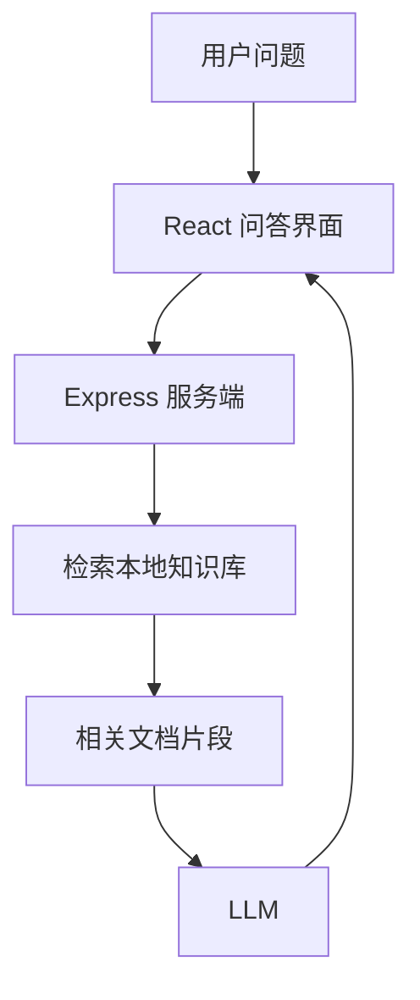

---
tags:
  - 项目复盘
type: project
domain: AI
topic: RAG
status: 已完成
created: 2026-10-08
repo: "demos/04-rag-minimal"
demo: "demos/04-rag-minimal"
---

# 04 RAG Minimal Demo

## 一句话介绍
> 面试 30 秒版本：基于 React、Express 和 Vercel AI SDK 实现最小 RAG（Retrieval-Augmented Generation，检索增强生成）问答应用，先从本地知识库检索相关内容，再将检索结果注入模型上下文生成回答。

## 目标与场景
- 解决什么问题：让模型基于本地知识库回答问题，减少模型不了解私有资料和产生幻觉的问题。
- 目标用户：自己（学习项目）。
- 为什么需要 AI（传统方案为什么不行）：传统关键词搜索只能返回文档片段，无法结合用户问题对多段内容进行自然语言总结。

## 技术栈
| 层 | 选型 | 为什么选它（备选方案是什么） |
| --- | --- | --- |
| 前端 | React + Vite | 快速搭建问答界面 |
| AI 编排 | Vercel AI SDK + Express | 连接模型调用和前端流式交互 |
| 模型 | OpenAI-compatible API | 复用统一的模型调用接口 |
| 存储 / 向量库 | 本地文档 | 保持 Demo 最小化，先验证检索增强主链路 |
| 部署 | 本地开发 | 当前目标是验证 RAG 基础流程 |

## 架构图

## 关键决策（面试重点）
1. **决策：先使用本地文档验证 RAG 主链路**
   - 备选方案：直接接入向量数据库和 Embedding 模型。
   - 选择理由：先拆开“检索”和“生成”两个问题，降低 Demo 的初始复杂度。
   - 代价 / 取舍：当前检索能力和数据规模有限，暂未验证生产级向量检索性能。

## 踩坑记录
| 问题 | 现象 | 根因 | 解决方式 | 概念链接 |
| --- | --- | --- | --- | --- |
|  |  |  |  | [[RAG 全链路]] |

## 效果与评估
- 评估方式（eval 集 / 人工验收标准）：
- 关键数据（首字延迟 / 单次成本 / 成功率）：
- 已知缺陷与兜底策略：

## STAR 面试素材
- **S 情境：**
- **T 任务：**
- **A 行动：**
- **R 结果：**

## 覆盖的考点
- [[RAG 全链路]]、[[Embedding 与向量检索]]

## 下一步迭代
- [ ] 增加固定评测集，验证检索结果是否真正支持答案
- [ ] 接入 Embedding 和向量数据库
- [ ] 增加回答来源展示和无相关资料时的拒答策略
