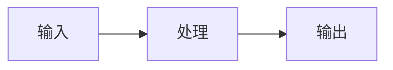

---
tags:
  - 概念卡
status: 学习中 # 学习中 / 已理解 / 已考核 / 需复习
created: <% tp.date.now("YYYY-MM-DD") %>
source: ""
---

# <% tp.file.title %>

## 一句话定义
> <% tp.file.cursor() %>

## 为什么需要
- 解决的问题：
- 没有它会怎样：

## 原理 / 流程
1. 
2. 
3. 

## 前端视角类比
- 类比：（用我已知的前端概念解释，例如 rerank ≈ 列表的二次精排）

## 关键 API / 参数
| 名称 | 作用 | 注意点 / 默认值 |
| --- | --- | --- |
|  |  |  |

## 踩过的坑
- [ ] 

## 面试追问
- **Q：**
  **A：**
- **Q：**
  **A：**

## 关联
- 上位概念：[[ ]]
- 相关概念：[[ ]]
- 项目实践：[[ ]]

## 费曼验收
- [ ] 不看笔记能给外行讲清楚
- [ ] 能徒手写出最小可运行 demo
- [ ] 模拟面试中能答出追问
