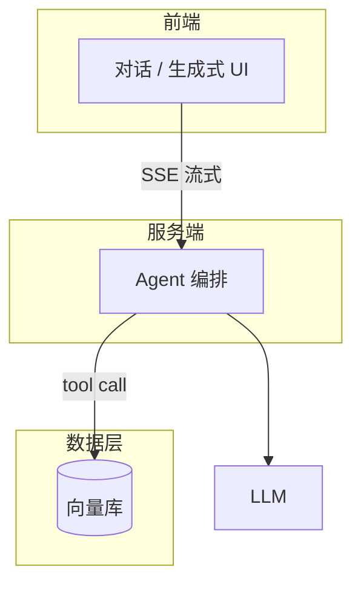

---
tags:
  - 项目复盘
status: 进行中 # 进行中 / 已完成 / 已演示
created: <% tp.date.now("YYYY-MM-DD") %>
repo: ""
demo: ""
---

# <% tp.file.title %>

## 一句话介绍
> 面试 30 秒版本：<% tp.file.cursor() %>做了什么 + 用了什么技术 + 效果数据

## 目标与场景
- 解决什么问题：
- 目标用户：
- 为什么需要 AI（传统方案为什么不行）：

## 技术栈
| 层 | 选型 | 为什么选它（备选方案是什么） |
| --- | --- | --- |
| 前端 |  |  |
| AI 编排 |  |  |
| 模型 |  |  |
| 存储 / 向量库 |  |  |
| 部署 |  |  |

## 架构图

## 关键决策（面试重点）
1. **决策：**
   - 备选方案：
   - 选择理由：
   - 代价 / 取舍：

## 踩坑记录
| 问题 | 现象 | 根因 | 解决方式 | 概念链接 |
| --- | --- | --- | --- | --- |
|  |  |  |  | [[ ]] |

## 效果与评估
- 评估方式（eval 集 / 人工验收标准）：
- 关键数据（首字延迟 / 单次成本 / 成功率）：
- 已知缺陷与兜底策略：

## STAR 面试素材
- **S 情境：**
- **T 任务：**
- **A 行动：**
- **R 结果：**

## 覆盖的考点
- [[ ]]、[[ ]]

## 下一步迭代
- [ ] 
